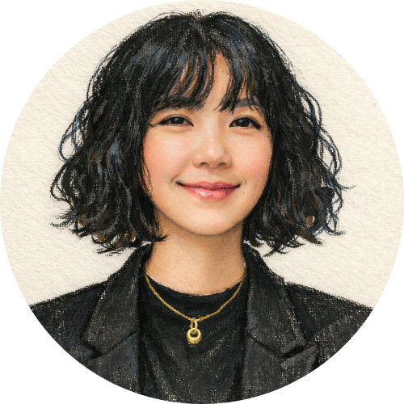
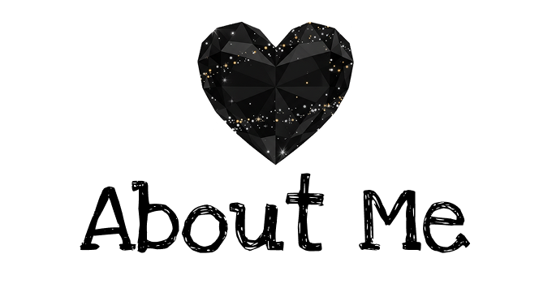
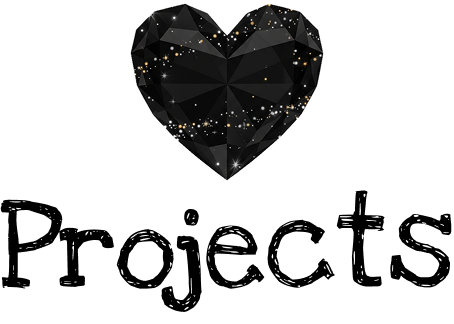
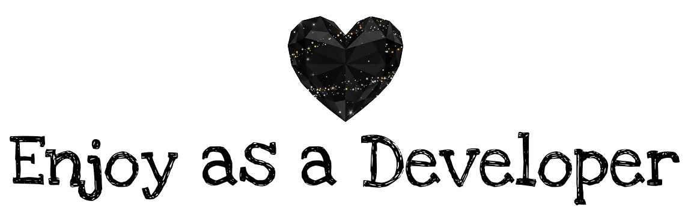

<!-- 프로필 이미지 -->

  

<!-- 정체성 문구 -->
<h3 align="center">
  안녕하세요👋🏻  
  차곡차곡 쌓은 경험 위에, 화면으로 성장을 그려가는 프론트엔드 개발자입니다.
</h3>

  멈추지 않는 호기심으로 배우고,
  함께 가고 싶은 동료가 되기 위해 꾸준히 실력을 쌓아갑니다.

 

<!-- 링크 버튼 -->

  
  
  
  
  

 

<!-- About Me -->

    
  <strong>프로젝트와 학습 과정에서 자연스럽게 만들어진 저의 개발 습관입니다.</strong>

 

### ✔ 끊임없는 배움의 자세
새로운 기술과 트렌드를 배우는 과정을 즐기며,  
학습한 내용을 프로젝트에 바로 적용해 경험으로 체화합니다.  
변화하는 개발 환경 속에서도 꾸준한 성장을 목표로 합니다.

### ✔ 꼼꼼함으로 만드는 완성도
작은 디테일까지 놓치지 않는 꼼꼼함으로  
코드 안정성과 사용자 경험을 함께 고려한 구현을 지향합니다.  
문제를 끝까지 해결하며 신뢰할 수 있는 결과물을 만들어가고자 합니다.

### ✔ 긍정적인 마인드로 문제 해결
어려운 상황에서도 긍정적인 태도로 원인을 분석하고 해결책을 찾습니다.  
시행착오를 성장의 과정으로 받아들이고, 경험을 팀과 공유합니다.

### ✔ 도전 정신으로 새로운 시도
낯선 기술과 새로운 프로젝트에도 주저하지 않고 도전합니다.  
새로운 시도를 통해 얻은 인사이트를 성장의 기준으로 삼습니다.

 

 

<!-- Skills -->

    
  <strong>실무에 가까운 구현을 목표로 익히고 사용해온 기술들입니다.</strong>

 

### ▸ 프론트엔드

  
  
  
  
  
  

### ▸ 백엔드

  
  
  
  

### ▸ DB · 서버

  
  
  

### ▸ 협업 · 도구

  
  
  
  
  
  

 

 

<!-- Projects -->

    
  <strong>기획부터 구현까지 직접 참여하며 완성한 대표 프로젝트들입니다.</strong>

 

## 🚲 서울시 공공자전거 ‘따릉이’ (클론 & 메인 구조 개선)
<table>
  <tr>
    <td width="35%">
      
    </td>
    <td width="65%">
      서울시 공공자전거 ‘따릉이’ 웹사이트를 분석하여  
      메인 화면 구조를 개선하고 사용자 중심의 서비스 페이지를 구현한 프로젝트
        
      <ul>
        <li>
          메인 화면 구조 개선을 통한 
          <strong>정보 탐색 흐름 단순화</strong>
        </li>
        <li>
          지도 API 기반 대여소 조회로 
          <strong>실질적인 사용자 편의성 강화</strong>
        </li>
        <li>
          공공 서비스 특성을 고려한 
          <strong>접근성 · 가독성 중심 UI 설계</strong>
        </li>
      </ul>
    </td>
  </tr>
</table>

> **사용 기술** - `HTML` · `CSS` · `JavaScript` · `jQuery` · `Map API` · `bxSlider`  
> 📂 **Repository** : [바로가기](레포지토리_URL)  |  🌐 **Live Demo** : [바로가기](포트폴리오_URL)

 

## 🏢 KD손해보험 관리자 페이지 (가상 보험사 백오피스 시스템)
<table>
  <tr>
    <td width="35%">
      
    </td>
    <td width="65%">
      보험사 관리자 페이지의 실무 구조를 이해하고  
      Spring 기반 데이터 관리 시스템을 구현한 백오피스 프로젝트
        
      <ul>
        <li>
          관리자 업무 흐름을 고려한 
          <strong>대시보드 · 관리 기능 중심 화면 설계</strong>
        </li>
        <li>
          고객 · 피보험자 · 계약 · 공지사항 등 
          <strong>핵심 데이터 CRUD 기능 구현</strong>
        </li>
        <li>
          Spring MVC 3계층 구조 기반
          <strong>확장성과 유지보수를 고려한 서버 설계</strong>
        </li>
      </ul>
    </td>
  </tr>
</table>

> **사용 기술** - `HTML` · `CSS` · `JSP` · `Spring MVC` · `MyBatis` · `Oracle DB` · `JDBC`  
> 📂 **Repository** : [바로가기](레포지토리_URL)  |  🌐 **Live Demo** : [바로가기](포트폴리오_URL)

 

## 🎬 리액트 기반 SPA 웹 애플리케이션
<table>
  <tr>
    <td width="35%">
      
    </td>
    <td width="65%">
      영상과 슬라이드 인터랙션을 중심으로  
      사용자 흐름에 맞게 구성한 리액트 기반 SPA 웹 애플리케이션
        
      <ul>
        <li>
          React Router를 활용한
          <strong>페이지 전환 구조 설계</strong>
        </li>
        <li>
          상태 관리와 생명주기를 통한
          <strong>UI의 실시간 반응 구현</strong>
        </li>
        <li>
          CSS 레이어 · 투명도 · 애니메이션을 활용한
          <strong>콘텐츠 몰입형 화면 구성</strong>
        </li>
      </ul>
    </td>
  </tr>
</table>

> **사용 기술** - `React` · `JavaScript` · `SPA` · `ReactRouter` · `Swiper` · `useState` · `useEffect` · `CSS`  
> 📂 **Repository** : [바로가기](레포지토리_URL)  |  🌐 **Live Demo** : [바로가기](포트폴리오_URL)

 

 

<!-- Enjoy as a Developer -->

    
  <strong>개발을 계속하게 만드는 순간들을 담았습니다.</strong>

 

  개발을 하면서 가장 즐거운 순간은 <ins>머릿속에만 있던 아이디어가</ins>  
  <mark>실제 화면과 기능으로 구현될 때</mark>입니다.

  새로운 기술을 배워 직접 적용해 보고, <ins>기능 하나하나가 연결되며</ins>  
  <mark>화면과 데이터 흐름이 살아나는 과정</mark>을 좋아합니다.    
  특히 “이 흐름이 더 낫지 않을까?” 고민하며 <em>구조를 다듬는 시간이 즐겁습니다.</em>

  작은 기능을 설계했을 뿐인데 <ins>전체 화면의 흐름이 더 깔끔해지고</ins>  
  <mark>사용자가 덜 헤매게 되는 순간</mark>에 큰 만족을 느낍니다.

  이전 직무에서 쌓아온 <ins>디자인 감각</ins>을 함께 녹여 기능뿐만 아니라  
  <mark>화면의 완성도까지 맞아떨어질 때</mark>,  
  <em>‘개발을 하길 잘했다’는 생각이 듭니다.</em>

  <ins>읽기 편하게 정리된 코드와 의도가 잘 보이는 구조</ins>를 마주할 때의 편안함도  
  제가 <mark>개발을 계속 즐길 수 있는 이유</mark> 중 하나입니다.

 

  

