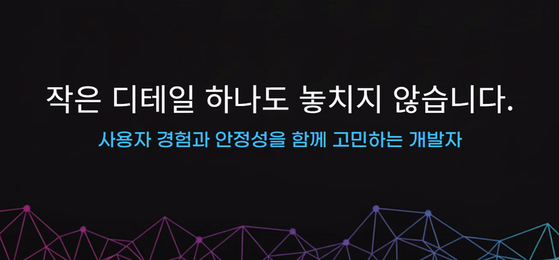

<!-- 프로필 이미지 -->

  

<h3 align="center">디테일과 화면의 흐름에 진심인 프론트엔드 개발자</h3>

  멈추지 않는 호기심으로 배우고,  
  함께 가고 싶은 동료로 성장하며,  
  꾸준함으로 실력을 쌓아갑니다.

 

<!-- 링크 버튼 -->

  &nbsp;
  &nbsp;
  &nbsp;
  &nbsp;
  

---

## 🚀 About Me

### #끊임없는_배움
새로운 기술과 트렌드를 배우는 것을 즐기며,  
공부한 내용을 **프로젝트에 바로 적용하며 경험으로 체화**하는 과정을 중요하게 생각합니다.  
변화하는 개발 환경에서도 유연하게 성장하는 개발자를 목표로 합니다.

### #꼼꼼한_성격
작은 디테일까지 놓치지 않는 성격으로,  
코드 안정성과 사용자 경험을 함께 고려합니다.  
문제를 끝까지 파고들어 해결하는 과정에서 큰 보람을 느낍니다.

### #긍정_마인드
어려운 상황에서도 긍정적으로 접근하며,  
실패와 시행착오를 성장의 발판으로 삼습니다.  
협업 과정에서도 원활한 소통으로 팀에 기여하고자 합니다.

### #도전_정신
낯선 기술과 새로운 프로젝트에도 주저하지 않고 도전합니다.  
새로운 시도를 통해 얻은 경험과 인사이트를  
더 나은 결과물로 연결하는 것을 좋아합니다.

---

## 🛠 Tech Stack

### Front-end

### Back-end

### DB · Server

### Tools

---
<!-- 타이핑 GIF 배너 -->

  

## 📌 Featured Projects

### 🚲 서울시 공공자전거 ‘따릉이’ 클론 및 UX 리디자인
기존 따릉이 웹사이트를 분석하여  
메인 화면 구조를 개선하고 서비스 페이지를 구현한 프로젝트  
👉 [GitHub Repo](test.com) | [Live Demo](test.com)

---

### 🏢 KD손해보험 관리자 페이지 (가상 보험사 백오피스 시스템)
보험사 관리자 페이지의 실무 구조를 이해하고  
Spring 기반 데이터 관리 시스템을 구현한 프로젝트  
👉 [GitHub Repo](test.com) | [Live Demo](test.com)

---

### 🎬 리액트 기반 SPA 웹 애플리케이션
새로고침 없이 페이지가 전환되는  
영상·슬라이드 중심의 웹 애플리케이션을 구현한 프로젝트  
👉 [GitHub Repo](test.com) | [Live Demo](test.com)

---

## 🎨 Work Style & Interests

- UI 디테일에 집착하는 편  
- 사용자 흐름을 먼저 고민하는 개발  
- 정적인 화면보다 **반응하는 인터페이스**를 선호  
